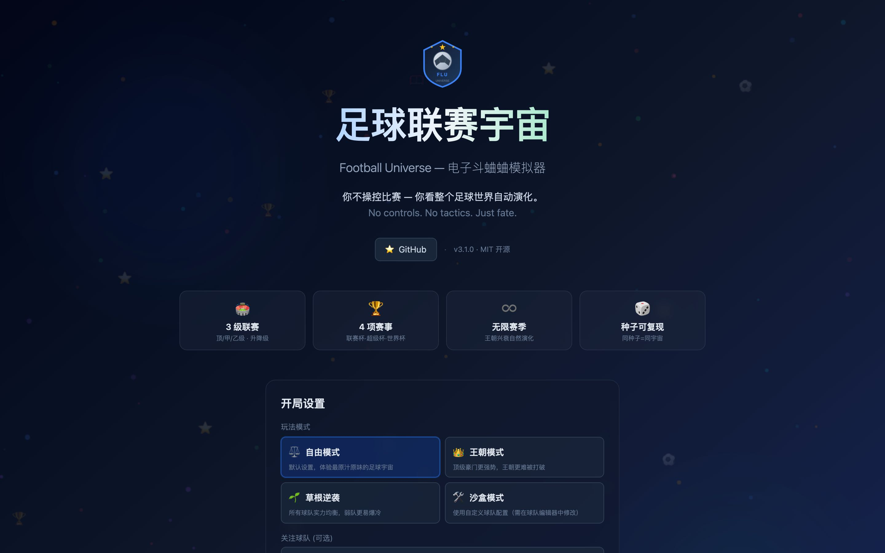
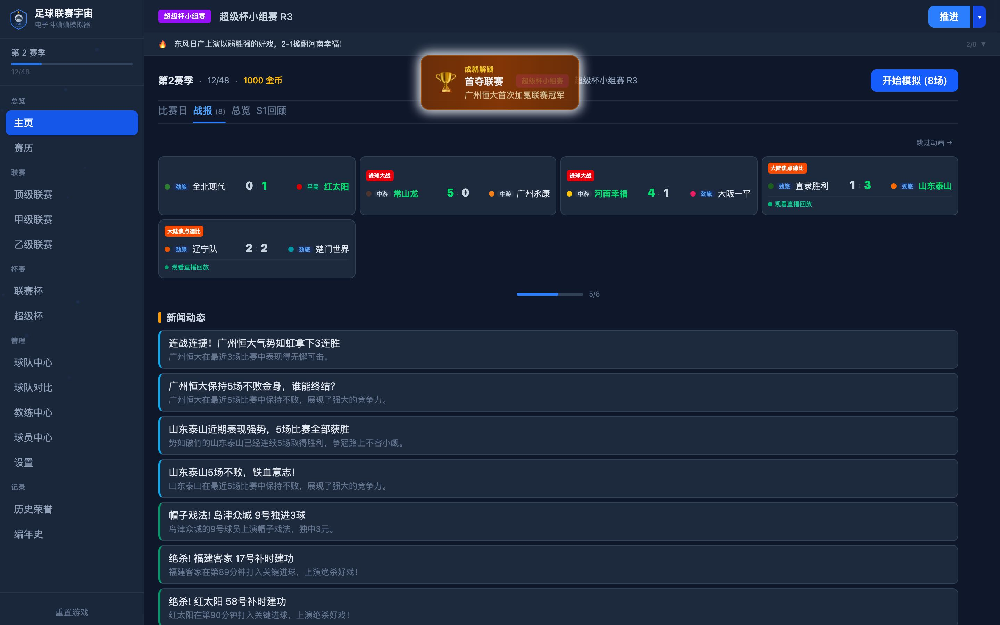
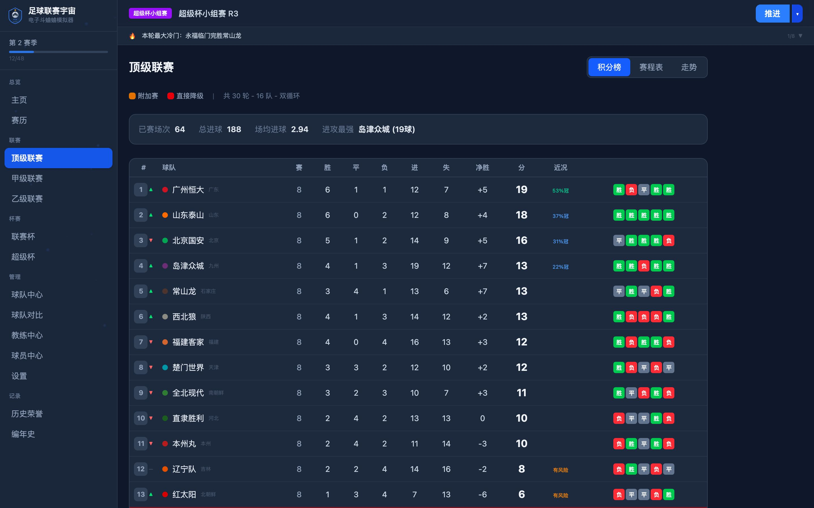
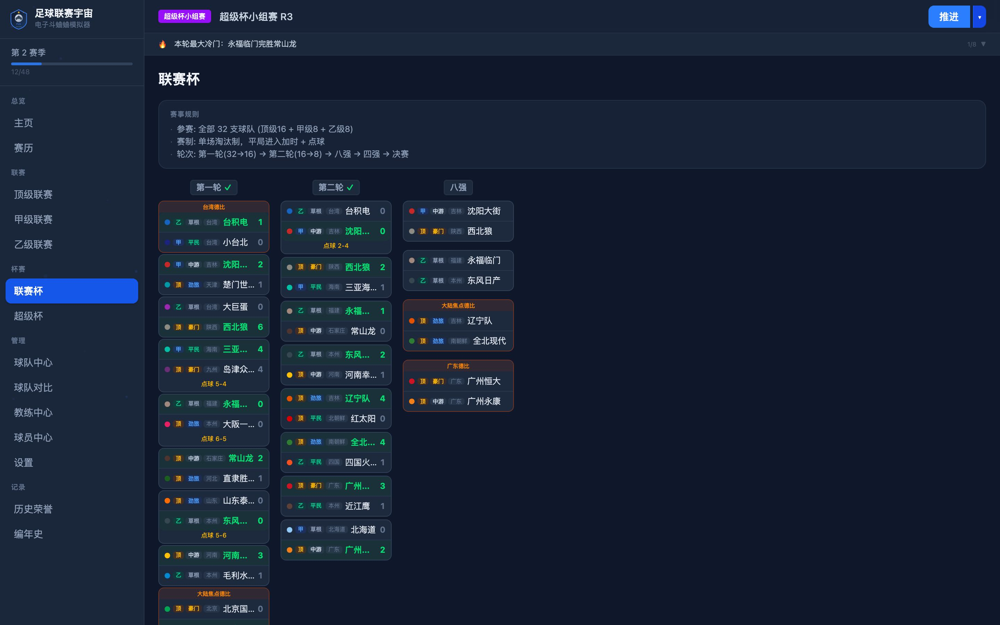
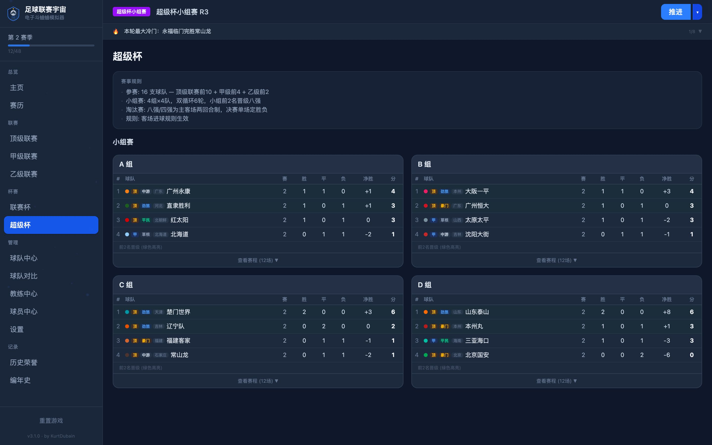
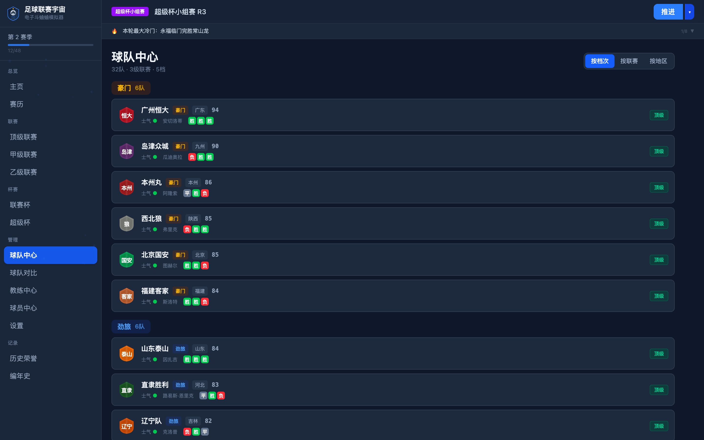
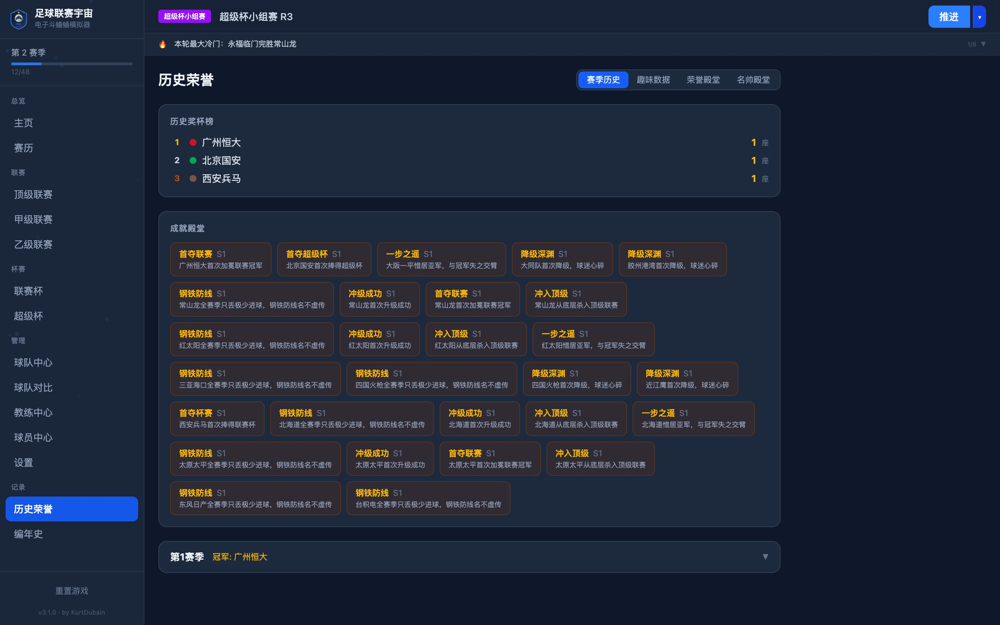
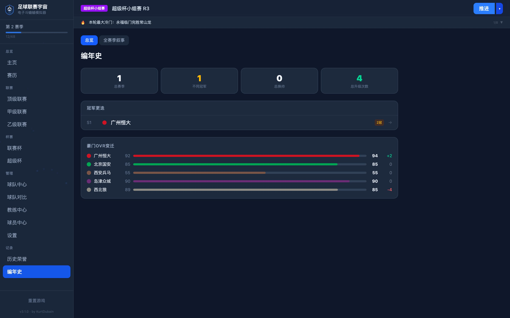
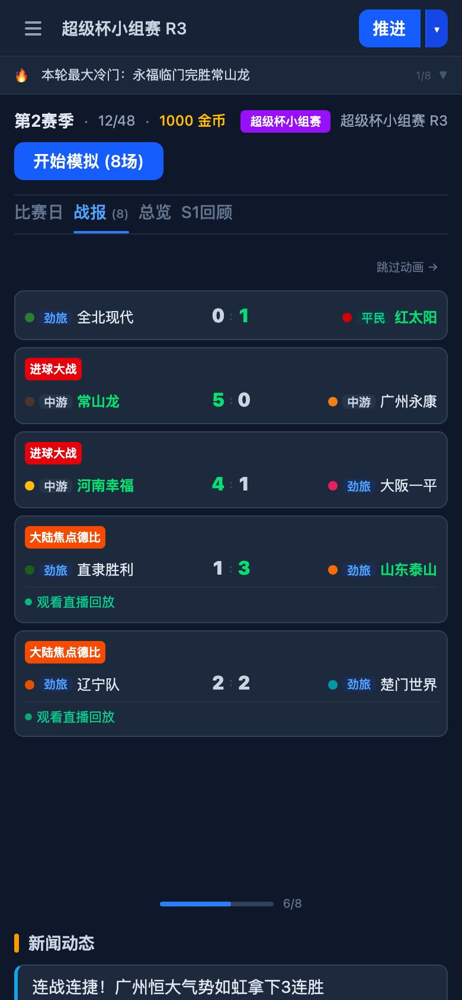

<p align="center">
  
</p>

<h1 align="center">足球联赛宇宙 ⚽</h1>
<h3 align="center">Football League Universe Simulator</h3>

<p align="center">
  <strong>你不操控比赛 — 你观看整个足球宇宙自动演化</strong><br/>
  <em>You don't play the matches — you watch an entire football universe unfold on its own.</em>
</p>

<p align="center">
  <a href="https://football-universe-ebon.vercel.app/"></a>
  <a href="https://github.com/KurtDubain/football-universe"></a>
</p>

<p align="center">
  
  
  
  
  
  
</p>

---

## English Summary

A **pure-frontend, observer-style football simulator**. Unlike Football Manager or ZenGM where you control teams, here you just watch — 32 teams across 3 leagues + 4 cups simulate themselves. Press "Advance" and witness:

- 🏆 Dynasties rise and crumble across infinite seasons
- 💥 Underdog cup runs and shocking upsets
- 👔 Coaches get fired under pressure, then resurrect at new clubs
- 📈 Team OVR drifts naturally with mean reversion
- 🎲 Deterministic seeded RNG — share your "universe" with one number

**4 game modes**: Free / Epic Dynasty / Underdog Rise / Sandbox (custom teams).
**30+ achievements**, story-driven season narratives, head-to-head match history, full multi-season chronicle, PWA-installable for offline play.

→ **[Try Live Demo](https://football-universe-ebon.vercel.app/)** ← (opens in browser, no signup)

---

## 这是什么？

按下「推进」键 — 联赛轮次翻出比分，杯赛冷门上演，教练被解雇，弱队奇迹升级……长期游玩自然生成"历史"和"故事"。**没有操控，只有命运。**

市面上的足球经理游戏都要你买卖球员、排阵型、做决策。**这个项目反其道而行**：你做一个上帝视角的观察者，看着王朝崛起、豪门沉沦、黑马逆袭、名帅下课。

---

## Screenshots | 截图

<p align="center">
  
  
</p>
<p align="center">
  
  
</p>
<p align="center">
  
  
</p>
<p align="center">
  
  
</p>
<p align="center">
  
</p>

---

## Features | 核心特性

### 🏟️ 完整联赛体系
三级联赛（16+8+8），双循环赛制，升降级 + 保级附加赛。冠军/降级实时概率、积分走势折线图、收官之战标签。

### 🏆 四大杯赛
| 赛事 | 赛制 | 频率 |
|------|------|------|
| **联赛杯** | 32队单场淘汰 5轮 | 每赛季 |
| **超级杯** | 16队 小组赛+两回合淘汰 | 每赛季 |
| **环球冠军杯** | 32队 8组循环+淘汰赛 | 每4赛季 |

对称淘汰赛对阵树 · 客场进球规则 · 杯赛规则卡

### 🎮 4 种游戏模式
- **自由模式** — 默认平衡设置
- **王朝模式** — 顶级豪门更强，王朝难破
- **草根逆袭** — 实力均衡，弱队多冷门
- **沙盒模式** — 配合自定义球队编辑器

### ⚽ 深度模拟引擎
泊松分布进球采样 + 多因素加权：OVR · 教练buff · 士气 · 疲劳 · 主场 · 动量 · 德比加成 · 弱队补正。**Seeded PRNG** 同种子 100% 可复现。

### 📺 Canvas 2D 比赛直播
22 个带号码球员实时传球跑动 · 5 种战术模式 · 进球金色光环 · 半场休息 · 文字解说

### 👔 教练生态
36 名教练 × 5 种风格 × 6 项 buff · 压力下课 + 合同到期 + 急流勇退 · 名帅殿堂排行榜 · 战术偏好分析

### 📊 无限历史 + 编年史
赛季回顾（含叙事文案）· 历史奖杯榜 · 趣味纪录 · **30+ 成就**（首次类/纪录类/数据类/王朝类/黑马类）· 编年史多赛季回顾 · 跨赛季交手记录

### 🎲 互动元素
赛季竞猜（猜冠军/降级队）· 上帝之手（每赛季 1 次球队 buff/debuff）· 手动解雇关注球队教练 · 虚拟币竞猜下注

### 🌍 大洲对抗系统
3 大洲（大陆/南洲/东洲）跨洲赛事统计 · 三层德比体系（巅峰/焦点/地区，OVR动态判定）

### 📱 PWA 离线
首次访问后可安装到桌面 · 完全离线可玩 · 自动更新

---

## Quick Start | 快速开始

**在线体验：** **[football-universe-ebon.vercel.app](https://football-universe-ebon.vercel.app/)**

本地运行：

```bash
git clone https://github.com/KurtDubain/football-universe.git
cd football-universe
pnpm install
pnpm dev      # http://localhost:5173
pnpm build    # 生产构建
```

> 需要 Node.js 22+

---

## Testing | 测试

```bash
pnpm test         # 跑一次（CI 用）
pnpm test:watch   # 监听模式（开发用）
pnpm test:ui      # Vitest UI（浏览器面板）
```

---

## Tech Stack | 技术栈

| Layer | Tech |
|-------|------|
| Build | **Vite 8** + **vite-plugin-pwa** |
| UI | **React 18** + **TypeScript 5** |
| State | **Zustand 5** (persisted to localStorage) |
| Styling | **Tailwind CSS 4** |
| Routing | **React Router 7** |
| RNG | Seeded **mulberry32** (deterministic) |
| Rendering | **Canvas 2D** (match live broadcast) |
| Deploy | **Vercel** (static site, CDN edge) |

~17,000 lines · 70+ source files · 14 pages · 12 components · 24 engine modules · 30+ achievements

<details>
<summary>📁 Project Structure</summary>

```
src/
├── engine/           — Pure simulation logic (UI-agnostic)
│   ├── match/        — RNG, Poisson sampling, simulator, events, prediction
│   ├── season/       — Calendar builder, season manager, post-match, season-end
│   ├── standings/    — League tables, schedules, promotion/relegation
│   ├── cups/         — League Cup, Super Cup, World Cup
│   ├── coaches/      — Coaching effects, pressure, hiring, contracts
│   ├── players/      — Player generation, stats tracking
│   ├── honors/       — Trophy tracking
│   ├── achievements.ts — 30+ unlockable achievements
│   └── events.ts     — Random season events
├── config/           — Game data (teams, coaches, derbies, balance)
├── types/            — TypeScript type definitions + game modes
├── pages/            — Route pages (Dashboard, League, Cup, Chronicle...)
├── components/       — Reusable components (MatchLive, SeasonReview...)
└── store/            — Zustand state management
```

</details>

---

## Roadmap | 路线图

- [x] 自定义球队编辑器
- [x] PWA 离线支持
- [x] 编年史与赛季叙事
- [x] 30+ 成就系统
- [x] 玩法模式（王朝/草根逆袭/沙盒）
- [ ] 完整英文 i18n（UI 已部分支持，引擎层待译）
- [ ] 球员名字系统（替代号码）
- [ ] 转会系统
- [ ] 球员成长 & 退役
- [ ] 自动生成赛季回顾分享图

---

## Contributing | 贡献

欢迎任何形式的贡献！Issues、PR、功能建议、bug 报告都可以。

```bash
pnpm install    # 安装依赖
pnpm dev        # 启动开发服务器
pnpm build      # 检查构建是否通过
```

代码风格：TypeScript strict, 函数式组件, Zustand for state.

---

## Changelog

<details>
<summary>展开查看完整日志</summary>

### Latest
- 4 游戏模式 + 球队编辑器 + PWA 支持
- 30+ 成就系统 + 解锁动画
- 编年史多赛季回顾 + 叙事文案生成
- 球员关键先生指标 + 教练战术分析
- 跨赛季 H2H 交手记录
- 大洲对抗系统 + 三层德比

### v3.1.0
- 设置页改造：游戏内指南、关注球队切换、历史统计
- 修复：WC 小组赛 competitionType, 教练压力多场处理

### v3.0.0
- 首次完整版本：3 级联赛 + 4 项赛事 + 32 球队
- Canvas 2D 比赛直播引擎
- 教练/球员/德比/成就基础系统

</details>

---

## License

[MIT](./LICENSE) — free to use, modify, distribute. Built with ❤️ as a personal weekend project.

---

<p align="center">
  <a href="https://football-universe-ebon.vercel.app/">🎮 Play Now</a> ·
  <a href="https://github.com/KurtDubain/football-universe">⭐ Star on GitHub</a> ·
  <a href="https://github.com/KurtDubain">by KurtDubain</a>
</p>
<p align="center">
  <sub>Built with React + TypeScript + Canvas 2D + Zustand + Tailwind + Vite PWA</sub>
</p>
